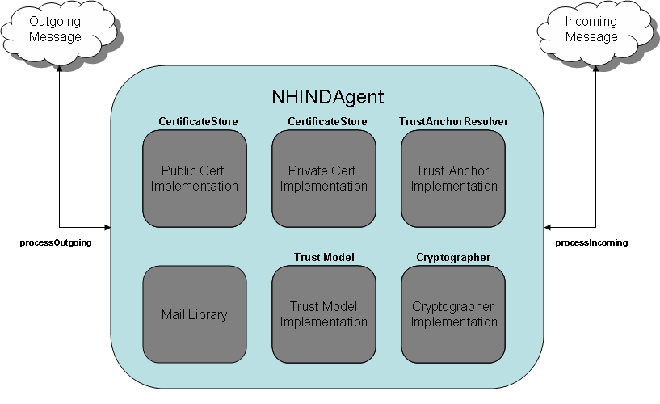

# Security and Trust Agent Architecture and Components

At a high level the agent can be viewed as a black box that implements the DirectProject [specification](http://wiki.directproject.org/w/images/e/e6/Applicability_Statement_for_Secure_Health_Transport_v1.2.pdf). Digging deeper into the box, the agent consists of a directly consumable API and several subsystems that can be directly consumed as stand-alone components.

Each component within the agent functions independently whilst the agent orchestrates the business logic between the internal components.

##### Core Components and Interfaces

* [NHINDAgent](NHINDAgent): Interface specification for the security and trust agent. Incoming and outgoing messages are processed by the agent according to the DirectProject [specification](http://wiki.directproject.org/w/images/e/e6/Applicability_Statement_for_Secure_Health_Transport_v1.2.pdf). [JavaDoc](http://api.directproject.info/agent/2.2.1/apidocs/org/nhindirect/stagent/NHINDAgent.html)
* [Cryptographer](Cryptographer): Interface specification for message encryption/decryption and message signature operations. [JavaDoc](http://api.directproject.info/agent/2.2.1/apidocs/org/nhindirect/stagent/cryptography/Cryptographer.html)
* [CertificateResolver](CertResolver): Certificate resolvers are responsible for locating public and private X509 certificates for destination and source addresses. Certificates are used for encryption/decryption, message signing, and signature validation. [JavaDoc](http://api.directproject.info/agent/2.2.1/apidocs/org/nhindirect/stagent/cert/CertificateResolver.html)
* [TrustModel](Trust): Interface specification for the trust enforcement policy. Trust is enforced by trust anchors, revocation policies, and an optional set of intermediate certificates. [JavaDoc](http://api.directproject.info/agent/2.2.1/apidocs/org/nhindirect/stagent/trust/TrustModel.html)
* [Mail Library](MailLib): Contains utility classes and specific implementations of agent mail classes. The majority of the classes are built on the [JavaMail](http://java.sun.com/products/javamail/javadocs/index.html) API. [JavaDoc](http://api.directproject.info/agent/2.2.1/apidocs/org/nhindirect/stagent/mail/package-summary.html)

Typically messages are processed by the agent using the appropriate incoming or outgoing method and return either a processed message or throw an exception if the message cannot be processed.

## IoC and DI Support

Inversion of control (IoC) and dependency injection (DI) are popular design patterns for componentized software. Most of the components support multiple IoC and DI frameworks through constructor and attribute setter methods; however, the agent module is biased towards the [Spring](https://spring.io/) framework and supports Spring specific constructs such as Spring Beans and Spring application contexts.

Although the protocol implementation bridges provided by the gateway [module](https://directprojectjavari.github.io/dns/) almost exclusively instantiate component instances using Spring, component instances can be instantiated directly without the use of DI.