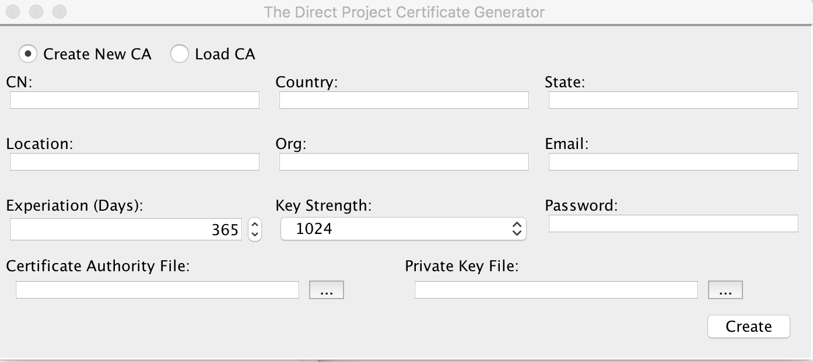
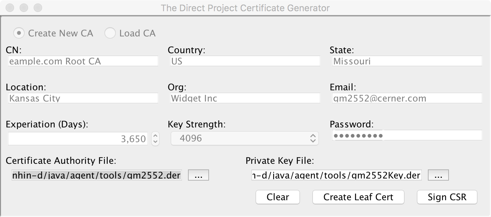
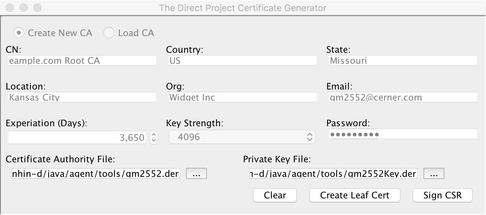
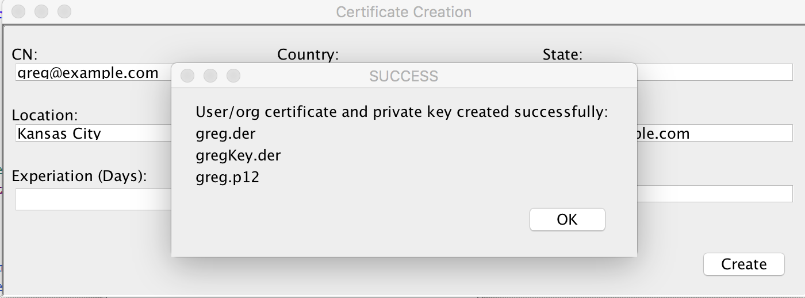
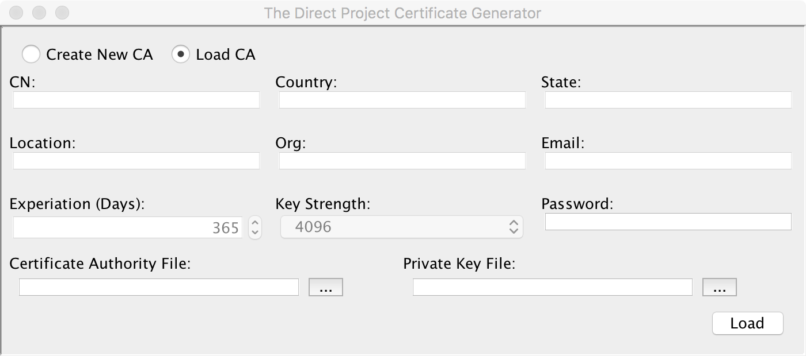

# Certificate Generation

The reference implementation source tree provides a simple tool for creating root certificate authorities (CAs), intermediate certificates authorities, and certificates. The tool is located under the /agent/tools directory in the source tree and is named certGen.sh for unix/linux based systems and certGen.bat for Windows.

## Certificate Jargon

The direct project uses X509 certificates for SMIME operations and X509 certificate authorities for enforcing message trust. A certificate authority is actually just a certificate with certain fields, policies, extensions. Specifically a certificate authority is a certificate that can sign subordinate certificates using its private key and has its basic constraint policy set to true. Root certificates are certificate authorities whose issuer and subfields are the same.

Intermediate certificate authorities or intermediate signing certificates are certificate authorities that have been signed by a higher level certificate authority and whose issuer is the certificate that signed the intermediate certificate authority. As you can see, certificates can form hierarchies called chains, and in some PKI infrastructures can become very complex.

A leaf certificate is a certificate that is at the bottom of a certificate hierarchy. Using third party/commercial certificate authorities, leaf certificates are generally created using a certificate signing request (or CSR) that complies with the [PKCS10](https://tools.ietf.org/html/rfc2986) specification. CSRs are signed by the certificate authority to create the leaf certificates.

In the direct project, certificate authorities are used as anchors for trust validation and leaf certificates are used for SMIME operations.

## Generation Steps

Numerous tools and commercial services are available for creating certificate chains, but they all follow the same general steps. Take for example a very simple certificate chain:

1. Generate and self sign a root certificate authority.
2. Generate a PKCS10 certificate signing request along with a public/private key pair for a leaf certificate.
3. Sign the PKCS10 request using with the certificate authority.
Open source tools such as openssl can be used to create your own certificate authorities and leaf certificates. Other commercial CAs such as [DigiCert](https://www.digicert.com/) and [IdenTrust](https://www.identrust.com/) can sign certificate requests for leaf certificate or intermediate signing certificates for a fee.

## CertGen

The certificate generation processes can be cumbersome for inexperienced users or financially unfeasible for development purposes. Tools such as openssl have a vast number of options and commands for creating a PKI infrastructures, and the syntax and steps can be daunting. The CertGen application is a GUI based tool for creating a simple certificate chain for development purposes. NOTE Certificates generated by this tool technically could be used for production HISP, however they do not meet the requirements of a good certificate practice statement and don't implement a PKI which includes attributes such as AIA extensions and links to CRLs. They may, however, be appropriate for pilot and laboratory purposes.

The following sections will walk you through creating certificate chains using the certGen tool.

To run the tool, run the following command in the /java/agent/tools directory or in the /tools directory if your are using the stock assembly package.

Windows:

```
certGen.bat
```

Unix/Linux/MAC

```
./certGen.sh
```

##### Creating A Chain From Scratch

The first step is creating a root certificate authority. The opening UI of the tool gives you an option of creating a new root CA or loading a CA from a pair of CA certificate and private key files.

**NOTE:** All files created by the tool are in DER format.



To create a new root CA, select Create New CA and fill in the fields with the appropriate values.

The first six fields are used in the new CA's distinguished name. The

* **CN:** Common name of the CA. This may be a short description of the CA. For example "Example.com Root CA".
* **Country:** The country where the institution creating the CA exists.
* **State:** The state where the institution creating the CA exists.
* **Location:** Generally the city where the institution creating the CA exists.
* **Org:** The name of the company, institution, or organization within an institution creating the CA exists.
* **Email:** Email address of the administrator of the CA. This email is not related to the addresses used in certificate for signing and encrypting messages.

Remaining fields:

* **Expiration:** Number of days from today that the CA will be valid. Production level CAs are generally valid for up to 20 years, but the tool defaults to 1 year.
* **Key Strength:** The size in bits of the certificates public/private key pair. Production level root CAs generally use a key strength of 2048 or 4096 bits, but the tool defaults to 1024 bits.
* **Password:** The password used to protect the CA's private key (PKCS8) file. This may be empty, however some third party tools may have compatibility issues with empty passwords.
* **Certificate Authority File:** The name of the CAs public certificate file. If this is left blank, the application will automatically create the file using the email address if available other wise the CN field with the extension .der in the current working directory.
* **Private Key File:** The name of the CAs private key file. If this is left blank, the application will automatically create the file using the email address if available other wise the CN field concatenated with the extension key.der in the current working directory.

After all fields are filled in, clicking the **create** button will generate the CA's certificate and PKCS8 private key files. The files will either be created in the working directory or in the locations specified by the *Certificate Authority File* and *Private Key File fields*. If the CA is generated successfully, a message will be displayed indicated the successful creation.

At this point you now have the option of creating a leaf certificate by clicking the **Crecte Leaf Cert** button or signing a PEM encoded CSR by clicking the **Sign CSR** button.



If you click the *Sign CSR* button, you are presented with a file selection dialog where you will navigate to and select a PEM encoded CSR file that you want to sign. Once selected, the tool will sign the CSR using the CA's private key and will generate a DER encoded certificate file.

If you click the *Crecte Leaf Cert* button, you are presented with the dialog to create a leaf certificate. Many of the fields are pre-populated with values from the CA.



The fields in the leaf certificate are almost identical to those in the CA with a few semantic exceptions:

* **CN:** Common name of the certificate. For user level certificates this should be the name of the user. For org level certificates, this should be the name of the domain that the certificate will be used for.
* **Email:** For user level certificates, the email address of the user associated with this certificate. For org level certificate, this **MUST** name of the domain that the certificate will be used for.

After filling out all fields, click the **create** button to generate the new leaf certificate. This will result in three new files that will be located in the tool's working directory.

* Public certificate file
* Private key file
* PKCS12 file.

The names' of the files are generated using the username of the email address of user level certificates or the domain name of org level certificates. For example, if a leaf certificate is generated for the email address greg@example.com, the following files are generate:



* **greg.der** - The public certificate file.
* **gregKey.der** - The PKCS8 private key file in PCKS8 format. This is encrypted if the password field is populated.
* **greg.p12** - The PCKS12 file that contains the public certificate and private key. NOTE This file is not encrypted or password protected. It is stored in a format that can be readily imported into the Direct Project's config UI tool.

##### Creating A Chain From An Existing CA

If you already have a previously created certificate authority file and its private key, you can generate leaf certificates from this CA.

To create certificates from an existing CA, select the **Load CA** from the tool's opening dialog.



Next populate the *Certificate Authority File* and *Private Key File* fields with the location of the respective files. If the private key file is password protected, you must fill in the *Password* field with the correct password. After filling in all fields, click the **Load** button.

If the CA is loaded successfully, all of the fields will be populated with information from the CA. At this point you can now create leaf certificates by clicking the **Crecte Leaf Cert** button.
